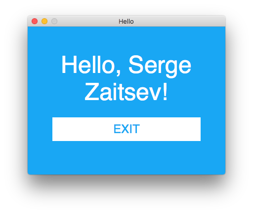
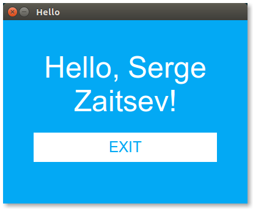
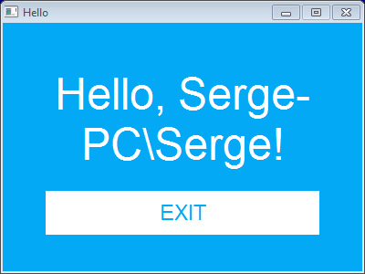

# webview

A tiny cross-platform webview library for C/C++/Golang.

It uses Cocoa/WebKit on macOS, gtk-webkit on Linux and good old MSHTML on Windows.

<p align="center"></p>
<p align="center"></p>
<p align="center"></p>

## API

There is only one function:

```
// C (#include "webview.h")
int webview(const char *title, const char *url,	int width, int height, int resizable);
// Go (package github.com/zserge/webview)
func Open(title, url string, w, h int, resizable bool) error
```

In C you can use Mongoose or any other web server/framework you like.

You may use it with Go web server running on a random port:

```go
ln, err := net.Listen("tcp", "127.0.0.1:0")
if err != nil {
	log.Fatal(err)
}
defer ln.Close()
go func() {
 	// Set up your http server here
	log.Fatal(http.Serve(ln, nil))
}()
webview.Open("Hello", "http://"+ln.Addr().String(), 400, 300, false)
```

## License

Code is distributed under MIT license, feel free to use it in your proprietary
projects as well.
