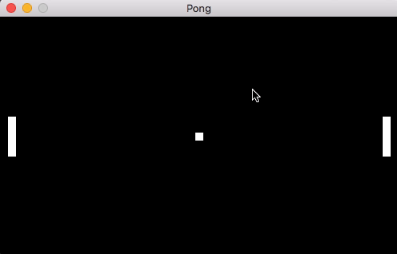

# Webview Pong (Go)

A simple Pong game using Webview. All the game logic is done on the Go side with drawing functions and input detection provided by JavaScript

No score, just a very simple demo. When launching the program, press space bar to start after clicking in the window, then use the arrow keys to move

